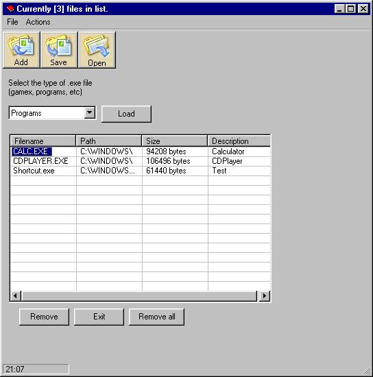



## A ListView example,, Save, Load, Retrieve filename,path etc from a file list\. MUST SE\!\+\+

### Description

This is a must-se example of ListView. It shows how to load, save the listview in a VERY easy way!

It shows how to load other programs FROM the listview and how to get the filename, path, size from a selected file from a file list. Discover how easy it really is!!! Please VOTE!
 
### More Info
 

             |
---                |---
**Submitted On**   |2003-05-03 21:04:58
**By**             |[&\#216;yvind](https://github.com/Planet-Source-Code/PSCIndex/blob/master/ByAuthor/216-yvind.md)
**Level**          |Intermediate
**User Rating**    |4.8 (53 globes from 11 users)
**Compatibility**  |VB 3\.0, VB 4\.0 \(16\-bit\), VB 4\.0 \(32\-bit\), VB 5\.0, VB 6\.0
**Category**       |[Miscellaneous](https://github.com/Planet-Source-Code/PSCIndex/blob/master/ByCategory/miscellaneous__1-1.md)
**World**          |[Visual Basic](https://github.com/Planet-Source-Code/PSCIndex/blob/master/ByWorld/visual-basic.md)
**Archive File**   |[ListView\_\_158287532003\.zip](https://github.com/Planet-Source-Code/216-yvind-a-listview-example-save-load-retrieve-filename-path-etc-from-a-file-list-must-se__1-45220/archive/master.zip)

